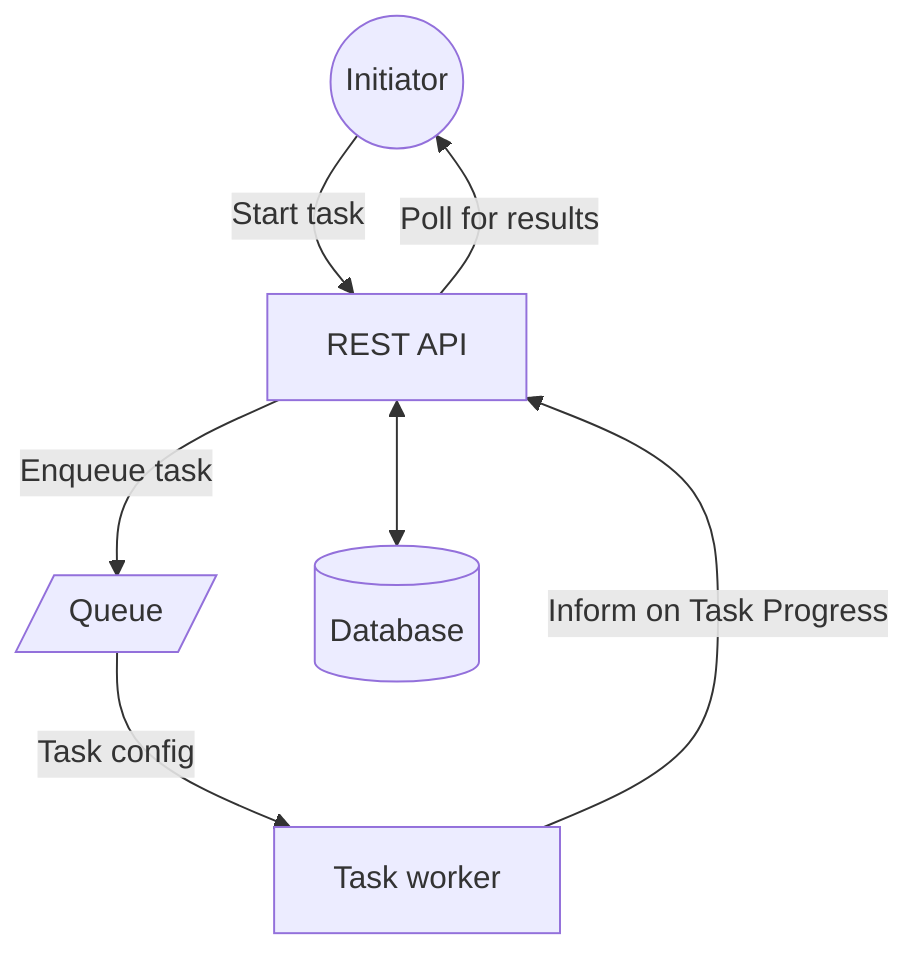

# FastAPI Async Task Workflow Example

A blueprint for a common pattern for asychronous task processing using a REST API as an entrypoint.

```mermaid

flowchart 
    i((Initiator)) -->|Start task| a 
    a -->|Poll for results| i 
    a[REST API] -->|Enqueue task| q[/Queue/]
    a[REST API] <--> db[(Database)]
    q --> |Task config|w[Task worker]
    w --> |Inform on Task Progress|a

```

